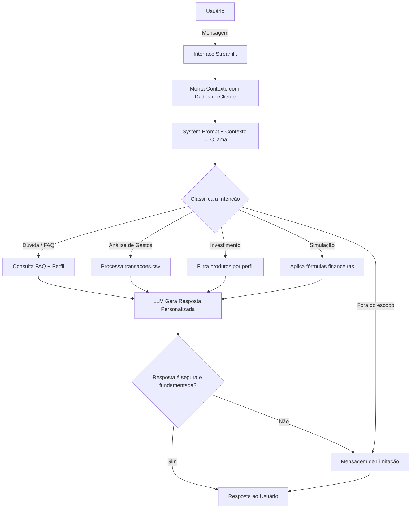

<div align="center">

<h1>💰 FinAI Assistant</h1>

<p><strong>Agente Financeiro Inteligente com IA Generativa</strong></p>

<p>
  
  
  
  
</p>

<p>
  Assistente conversacional financeiro que combina IA generativa, engenharia de prompts e dados contextuais para oferecer orientação financeira personalizada, segura e sem alucinações.
</p>

</div>

---

## 📋 Índice

- [Sobre o Projeto](#-sobre-o-projeto)
- [Demonstração](#-demonstração)
- [Arquitetura](#-arquitetura)
- [Base de Conhecimento](#-base-de-conhecimento)
- [Engenharia de Prompts](#-engenharia-de-prompts)
- [Tecnologias](#-tecnologias)
- [Pré-requisitos](#-pré-requisitos)
- [Instalação e Execução](#-instalação-e-execução)
- [Estrutura do Repositório](#-estrutura-do-repositório)
- [Avaliação e Métricas](#-avaliação-e-métricas)
- [Segurança e Anti-Alucinação](#-segurança-e-anti-alucinação)
- [Documentação](#-documentação)

---

## 🎯 Sobre o Projeto

A maioria dos aplicativos financeiros entrega números e gráficos, mas não orienta o usuário sobre **o que fazer com eles**. O FinAI Assistant resolve isso: um agente conversacional que analisa o perfil, histórico e metas do cliente e responde em linguagem natural, de forma personalizada e responsável.

### Problema

- Pessoas com dificuldade em interpretar sua própria situação financeira
- Ferramentas que mostram dados, mas não geram entendimento
- Falta de acesso a orientação financeira personalizada e confiável
- Soluções genéricas que ignoram o contexto e o perfil do usuário

### Solução

O FinAI Assistant atua como um **mentor financeiro digital** que:

- Analisa gastos por categoria e identifica padrões
- Acompanha o progresso em direção às metas financeiras
- Recomenda produtos compatíveis com o perfil do investidor
- Realiza simulações financeiras com explicação dos cálculos
- Responde perguntas em linguagem natural usando a base de conhecimento do cliente
- Admite limitações e nunca inventa informações

---

## 🖥 Demonstração

> Interface conversacional via Streamlit com modelo local via Ollama.

**Exemplo de interação:**

```
Usuário  →  "Quanto falta para completar minha reserva de emergência?"

FinAI    →  Você já possui R$ 10.000 guardados e sua meta é R$ 15.000.
            Faltam R$ 5.000 para completar sua reserva.
            Com seu saldo mensal disponível de ~R$ 2.500, você pode
            atingir esse objetivo em cerca de 2 meses mantendo o ritmo.
            Quer que eu simule diferentes cenários de aporte?
```

```
Usuário  →  "Qual investimento você recomenda para mim?"

FinAI    →  Como seu perfil é moderado e o foco é reserva de emergência,
            recomendo priorizar segurança e liquidez:
            • Tesouro Selic — baixo risco, aporte mínimo de R$ 30
            • CDB Liquidez Diária — 102% do CDI, resgate a qualquer momento
            Evitarei sugestões de risco alto neste momento.
```

---

## 🏗 Arquitetura

### Diagrama de Blocos

```
┌─────────────────────────────────────────────────────────────────┐
│                        FINAI ASSISTANT                          │
│                                                                 │
│  ┌──────────┐    ┌─────────────────┐    ┌──────────────────┐   │
│  │ Usuário  │───▶│   Streamlit     │───▶│  System Prompt   │   │
│  └──────────┘    │   Interface     │    │  + Contexto      │   │
│       ▲          └─────────────────┘    │  Estruturado     │   │
│       │                                 └────────┬─────────┘   │
│       │                                          │             │
│  ┌────┴─────────────────────────┐               ▼             │
│  │      BASE DE CONHECIMENTO    │    ┌──────────────────────┐  │
│  │                              │    │   Ollama (gpt-oss)   │  │
│  │  perfil_investidor.json      │───▶│   Execução local     │  │
│  │  transacoes.csv              │    └──────────┬───────────┘  │
│  │  historico_atendimento.csv   │               │              │
│  │  produtos_financeiros.json   │               ▼              │
│  │  simulacoes_financeiras.json │    ┌──────────────────────┐  │
│  │  faq_financeiro.json         │    │  Validação de Escopo │  │
│  └──────────────────────────────┘    │  Anti-Alucinação     │  │
│                                      └──────────┬───────────┘  │
│                                                 │              │
│                                                 ▼              │
│                                      ┌──────────────────────┐  │
│                                      │   Resposta Final     │  │
│                                      └──────────────────────┘  │
└─────────────────────────────────────────────────────────────────┘
```

### Fluxo de Decisão



### Decisões de Design

| Decisão | Escolha | Motivo |
|---------|---------|--------|
| LLM | Ollama local (`gpt-oss`) | Privacidade dos dados + sem custo de API |
| Interface | Streamlit | Prototipagem rápida com foco na lógica do agente |
| Contexto | Injetado no prompt por requisição | Simplicidade — sem necessidade de vetor DB |
| Dados | CSV + JSON mockados | Sem exposição de dados sensíveis reais |
| Segurança | Regras no system prompt | Controle declarativo e auditável do comportamento |

---

## 📚 Base de Conhecimento

Todos os dados são carregados em memória na inicialização e montados como um bloco de contexto estruturado a cada requisição:

| Arquivo | Tipo | Conteúdo |
|---------|------|----------|
| `data/perfil_investidor.json` | JSON | Nome, idade, renda, perfil de risco e metas financeiras |
| `data/transacoes.csv` | CSV | Histórico de entradas e saídas por categoria |
| `data/historico_atendimento.csv` | CSV | Interações anteriores para continuidade contextual |
| `data/produtos_financeiros.json` | JSON | Catálogo com risco, rentabilidade e aporte mínimo |
| `data/simulacoes_financeiras.json` | JSON | Fórmulas de juros compostos, aportes e parcelamento |
| `data/faq_financeiro.json` | JSON | Pares pergunta/resposta calibrados para o perfil do cliente |

### Exemplo de Contexto Montado

```python
contexto = f"""
DADOS DO CLIENTE:
- Nome: {perfil['nome']} | Perfil: {perfil['perfil_investidor']}
- Renda: R$ {perfil['renda_mensal']} | Aceita Risco: {"Sim" if perfil['aceita_risco'] else "Não"}
- Reserva Atual: R$ {perfil['reserva_emergencia_atual']}

METAS FINANCEIRAS:
{json.dumps(perfil['metas'], indent=2, ensure_ascii=False)}

TRANSAÇÕES RECENTES:
{transacoes.to_string(index=False)}

PRODUTOS DISPONÍVEIS:
{json.dumps(produtos, indent=2, ensure_ascii=False)}

SIMULAÇÕES FINANCEIRAS:
{json.dumps(simulacoes, indent=2, ensure_ascii=False)}
"""
```

---

## 🧠 Engenharia de Prompts

O comportamento do agente é controlado por um system prompt estruturado em seções funcionais:

```
IDENTIDADE        → Quem é o agente e qual seu objetivo
DIRETRIZES        → Como personalizar e adaptar as respostas
USO DOS DADOS     → Quando usar cada arquivo da base de conhecimento
REGRAS DE SEGURANÇA → O que nunca fazer (anti-alucinação)
ESTILO            → Tom de voz, linguagem e nível de detalhe
COMPORTAMENTO     → Mapeamento intenção → fonte de dados
LIMITAÇÕES        → O que está fora do escopo do agente
```

A técnica central é **Few-Shot Prompting com contexto estruturado**: ao injetar os dados reais do cliente no prompt junto com as instruções, o modelo sempre ancora as respostas em fatos verificáveis — sem espaço para especulação.

---

## 🛠 Tecnologias

| Tecnologia | Versão | Papel no Projeto |
|-----------|--------|-----------------|
| Python | 3.10+ | Linguagem principal |
| Streamlit | 1.x | Interface conversacional web |
| Ollama | Latest | Execução local do LLM (sem API externa) |
| Pandas | 2.x | Carregamento e processamento dos CSVs |
| Requests | 2.x | Comunicação HTTP com a API do Ollama |

---

## ✅ Pré-requisitos

- Python **3.10** ou superior
- [Ollama](https://ollama.com) instalado e em execução local
- Modelo `gpt-oss` disponível

```bash
# Verificar instalação do Ollama
ollama list

# Baixar o modelo
ollama pull gpt-oss

# Testar
ollama run gpt-oss "Olá!"
```

---

## 🚀 Instalação e Execução

```bash
# 1. Clone o repositório
git clone https://github.com/seu-usuario/finai-assistant.git
cd finai-assistant

# 2. Crie e ative um ambiente virtual
python -m venv .venv
source .venv/bin/activate        # Linux/macOS
.venv\Scripts\activate           # Windows

# 3. Instale as dependências
pip install -r src/requirements.txt

# 4. Certifique-se de que o Ollama está rodando
ollama serve

# 5. Inicie a aplicação
streamlit run src/app.py
```

Acesse: `http://localhost:8501`

> **Configuração:** Por padrão, a aplicação se conecta ao Ollama em `http://localhost:11434`. Para alterar, edite `OLLAMA_URL` em `src/app.py`.

---

## 📁 Estrutura do Repositório

```
finai-assistant/
│
├── README.md                            # Este arquivo
│
├── data/                                # Base de conhecimento (dados mockados)
│   ├── perfil_investidor.json           # Perfil financeiro do cliente
│   ├── transacoes.csv                   # Histórico de transações mensais
│   ├── historico_atendimento.csv        # Histórico de atendimentos anteriores
│   ├── produtos_financeiros.json        # Catálogo de produtos com risco e rentabilidade
│   ├── simulacoes_financeiras.json      # Fórmulas de simulação financeira
│   └── faq_financeiro.json              # FAQ personalizado ao perfil do cliente
│
├── docs/                                # Documentação técnica do projeto
│   ├── 01-documentacao-agente.md        # Caso de uso, persona e arquitetura
│   ├── 02-base-conhecimento.md          # Estratégia de dados e integração
│   ├── 03-prompts.md                    # System prompt, exemplos e edge cases
│   ├── 04-metricas.md                   # Testes, resultados e formulário de avaliação
│   └── 05-pitch.md                      # Roteiro do pitch de 3 minutos
│
├── src/
│   └── app.py                           # Aplicação principal (Streamlit + Ollama)
│
├── assets/                              # Imagens, screenshots e diagramas
│
└── examples/                            # Referências de implementação
    └── README.md
```

---

## 📊 Avaliação e Métricas

Quatro cenários de teste foram executados para validar o comportamento do agente:

| # | Cenário | Entrada | Resultado |
|---|---------|---------|-----------|
| 1 | Consulta de gastos | `"Quanto gastei com alimentação?"` | ✅ R$ 570,00 retornado corretamente |
| 2 | Recomendação de produto | `"Qual investimento você recomenda?"` | ✅ Tesouro Selic / CDB (compatível com perfil moderado) |
| 3 | Fora do escopo | `"Qual a previsão do tempo?"` | ✅ Redirecionado sem resposta inventada |
| 4 | Produto inexistente | `"Quanto rende o produto XYZ?"` | ✅ Limitação admitida explicitamente |

### Pontuação Média (escala 1–5)

| Métrica | O que avalia | Nota |
|---------|-------------|------|
| **Assertividade** | A resposta respondeu ao que foi perguntado? | **5 / 5** |
| **Segurança** | As informações pareceram confiáveis? | **5 / 5** |
| **Coerência** | A linguagem foi clara e adequada ao perfil? | **5 / 5** |

---

## 🔒 Segurança e Anti-Alucinação

| Estratégia | Implementação |
|-----------|--------------|
| **Dados como âncora** | O modelo só responde com base nos arquivos carregados — nunca especula |
| **Perfil como filtro** | Produtos de risco alto são bloqueados para perfil moderado |
| **Escopo declarado** | Perguntas fora do domínio financeiro são redirecionadas explicitamente |
| **Transparência nos cálculos** | Simulações mostram a fórmula e os valores utilizados |
| **Limitações explícitas** | O agente nunca se posiciona como substituto de consultoria profissional |
| **Admissão de ignorância** | Quando não há dado suficiente, o agente declara a limitação |

---

## 📄 Documentação

| Documento | Conteúdo |
|-----------|----------|
| [`01-documentacao-agente.md`](./docs/01-documentacao-agente.md) | Caso de uso, persona, arquitetura e estratégias de segurança |
| [`02-base-conhecimento.md`](./docs/02-base-conhecimento.md) | Estratégia de dados, carregamento e exemplo de contexto montado |
| [`03-prompts.md`](./docs/03-prompts.md) | System prompt completo, exemplos de interação e edge cases |
| [`04-metricas.md`](./docs/04-metricas.md) | Cenários de teste, resultados e formulário de feedback |
| [`05-pitch.md`](./docs/05-pitch.md) | Roteiro do pitch de 3 minutos com checklist de entrega |

---

<div align="center">
  <sub>Desenvolvido como solução para o desafio <strong>Agente Financeiro Inteligente com IA Generativa</strong> · <a href="https://dio.me">DIO</a></sub>
</div>
