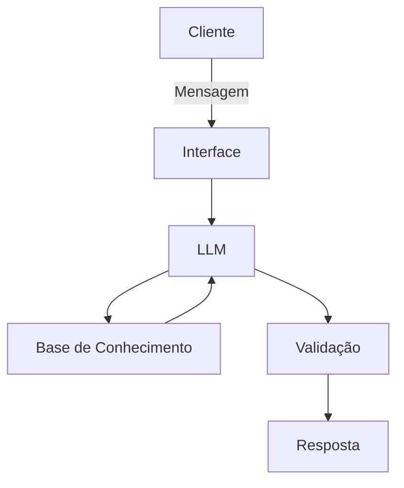

# Documentação do Agente

## Caso de Uso

### Problema
> Qual problema financeiro seu agente resolve?

Muitos usuários possuem dúvidas financeiras básicas em seu dia-a-dia, como cálculos de parcelas, 
rendimento de investimentos e até mesmo compreensão de produtos financeiros,
isso se deve a dificuldade da linguagem técnica, falta de personalização e acesso limitado a orientação
confiável.

Além disso, ferramentas tradicionais são pouco intuitivas trazendo dificuldades na experiência dos usuários.

### Solução
> Como o agente resolve esse problema de forma proativa?

O agente utiliza IA generativa para compreender perguntas de forma natural, identificando a intenção do
usuário e fornecando respostas claras e objetivas.

Sendo capaz de:

- Explicar conceitos financeiros de forma simples
- Simular cenários (juros, parcelas, rendimento)
- Adaptar respostas ao contexto da conversa
- Guiar o usuário com sugestões educativas

### Público-Alvo
> Quem vai usar esse agente?

[Sua descrição aqui]

---

## Persona e Tom de Voz

### Nome do Agente
[Nome escolhido]

### Personalidade
> Como o agente se comporta? (ex: consultivo, direto, educativo)

[Sua descrição aqui]

### Tom de Comunicação
> Formal, informal, técnico, acessível?

[Sua descrição aqui]

### Exemplos de Linguagem
- Saudação: [ex: "Olá! Como posso ajudar com suas finanças hoje?"]
- Confirmação: [ex: "Entendi! Deixa eu verificar isso para você."]
- Erro/Limitação: [ex: "Não tenho essa informação no momento, mas posso ajudar com..."]

---

## Arquitetura

### Diagrama

### Componentes

| Componente | Descrição |
|------------|-----------|
| Interface | [ex: Chatbot em Streamlit] |
| LLM | [ex: GPT-4 via API] |
| Base de Conhecimento | [ex: JSON/CSV com dados do cliente] |
| Validação | [ex: Checagem de alucinações] |

---

## Segurança e Anti-Alucinação

### Estratégias Adotadas

- [ ] [ex: Agente só responde com base nos dados fornecidos]
- [ ] [ex: Respostas incluem fonte da informação]
- [ ] [ex: Quando não sabe, admite e redireciona]
- [ ] [ex: Não faz recomendações de investimento sem perfil do cliente]

### Limitações Declaradas
> O que o agente NÃO faz?

[Liste aqui as limitações explícitas do agente]
